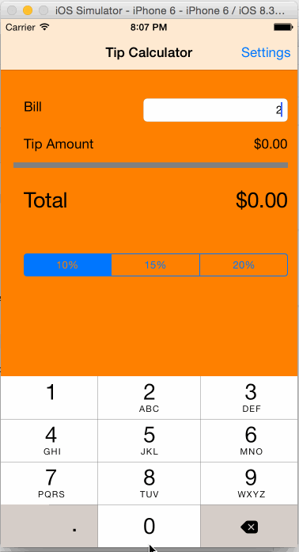

# IOS prework - TipCalculator

This is a Tip Calculator application for iOS submitted as the [pre-assignment](https://gist.github.com/timothy1ee/7747214) requirement for CodePath.

Time spent: [Write the number of hours you spend here]

Completed:

* [x] Required: User can enter a bill amount, choose a tip percentage, and see the tip and total values.
* [x] Required: Settings page to change the default tip percentage.

Note: to embed the gif file, just check your gif file into your repo and update the name of the file above.
